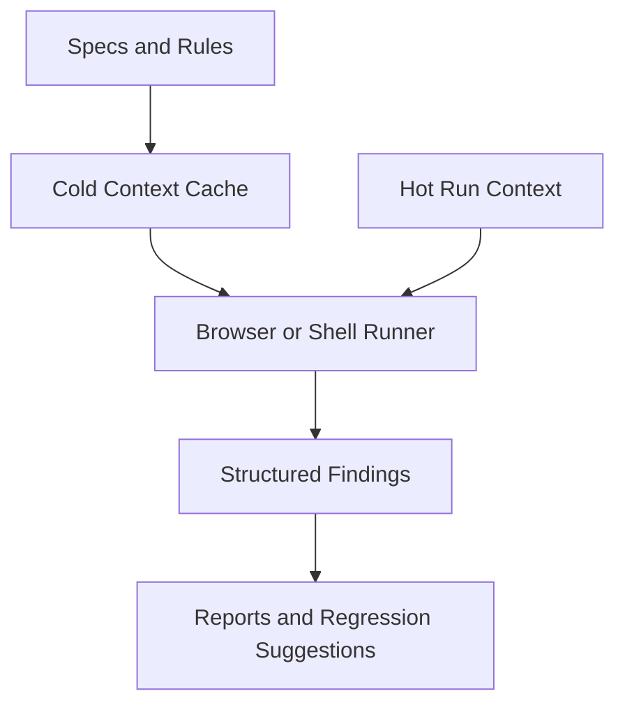

SpecLoop is a Rust CLI and protocol for running QA loops from product specs,
business rules, acceptance criteria, and critical flows.

It gives agents a safer job:

```text
Read specs -> inspect behavior -> collect evidence -> write findings -> suggest regression tests
```

## Who It Is For

- AI-native product teams.
- Developers using coding agents.
- QA engineers turning product knowledge into repeatable checks.
- Technical founders who want open-core leverage without losing commercial control.

## Mental Model



## Start

```bash
cargo install --path crates/specloop-cli
specloop init
specloop validate
specloop run --action "open landing page"
specloop report
```

`specloop init` creates the default `.specloop/` context plus starter browser
scenarios and loop runbooks. Use `specloop scaffold all` when you also want the
optional agent, skill, command, and script assets.

## Current Status

v0 is a local CLI and protocol MVP with scaffolded browser helpers. Full Chrome
DevTools MCP runtime integration remains the next execution layer.
